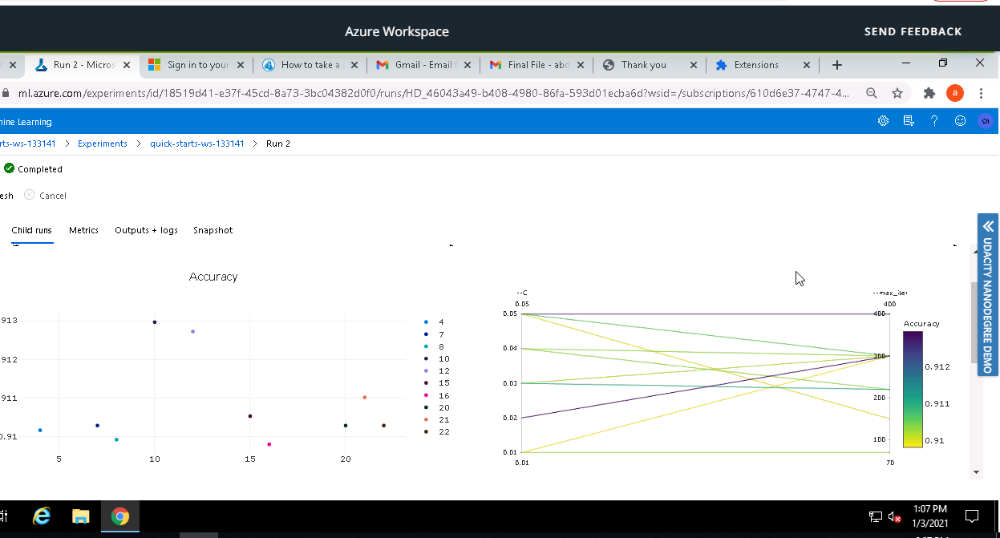
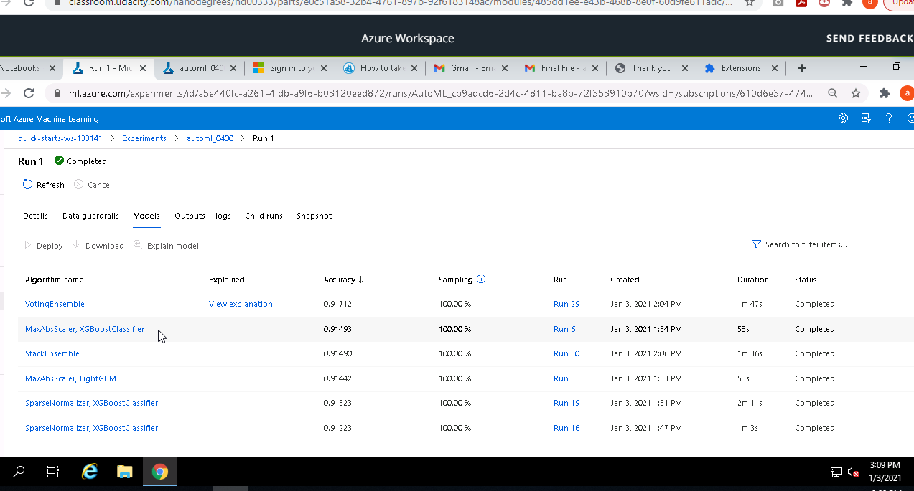

# Optimizing an ML Pipeline in Azure

## Overview
This project is part of the Udacity Azure ML Nanodegree. In this project, we build and optimize an Azure ML pipeline using the Python SDK and a provided Scikit-learn model. This model is then compared to an Azure AutoML run. 

Azure Python SDK is the open-source Azure libraries for Python simplify provisioning, managing, and using Azure resources from Python application code. It is composed solely of over 180 individual Python libraries that relate to specific Azure services.

AutoML, is the process of automating the time consuming, iterative tasks of machine learning model development. It allows data scientists, analysts, and developers to build ML models with high scale, efficiency, and productivity all while sustaining model quality. Traditional machine learning model development is resource-intensive, requiring significant domain knowledge and time to produce and compare dozens of models. With automated machine learning, you'll accelerate the time it takes to get production-ready ML models with great ease and efficiency.

## Summary
### Problem
We have given a dataset of Bank Marketing of a Portuguese banking institution. Primary task is classification and we have to predict if the client will subscribe a term deposit. Dataset consists of 20 features and 32,950 rows.
We will have to clean the dataset according to requirement before using any model and moreover dataset has class imbalance and no null values.
The link for the dataset is https://automlsamplenotebookdata.blob.core.windows.net/automl-sample-notebook-data/bankmarketing_train.csv

### Solution
We have used two different approaches to solve the given problem. Firstly we used logistic regression on Python SDK with or choice of parameters and secondly we used Azure AutoML. After using Python SDK we got accuracy of 0.91296 and after using AutoML we got .9171 with VotingEnsemble algorithm. 

## Scikit-learn Pipeline
We wrote train.py script and hyperdrive coding to do data collection, data cleaning, data splitting, model training, hyperparameter sampling model testing, early stopping policy and saving the model. Following are the steps involved in scikit-learn pipeline:

a)	Dataset of bankmarketing is extracted from the link provided and we used TabularDatasetFactory. We did some exploration and understand the meaning of each features.

b)	After loading the dataset we started data cleaning by dropping rows with empty values and one hot encoding for categorical columns.

c)	After cleaning the dataset, we split the data into training and testing dataset. For this experiment we split our data in to 75% for training and 25% for testing.

d)	After splitting the data, further we went for selection of best algorithm for classification problem which is LogisticRegression because we are trying to predict if a client will subscribe to a term deposit product. 

e)	After the creation of the model, we calculate it's Accuracy.

f)	To improve the accuracy of the model we optimized hyperparameters using Hyperdrive. There are two hyperparameters for this model, C and max_iter. C is the inverse regularization strength and max_iter is the maximum iteration to converge for the Logistic Regression.

g)	We used RandomParameterSampling to try different sets of hyperparameter in order to maximize Accuracy. Benefit of RandomSampling is it choose hyperparamters randmoly thus reducing the computational time and complexity. Other options we had were Grid sampling and Bayesian sampling both of them had their own importance like Grid sampling confines the search within a given set of paramters while Bayesian sampling select the next set of hyperparameters based on how the previous hyperparams performed

h)	The parameter search space used for C is [0.01,0.02,0.03,0.04,0.05] and for max_iter is [70,150,220,300,400]

i)	 For this experiment the configuratin used is; evaluation_interval=1, slack_factor=0.01, and delay_evaluation=3

j)	Early stopping policy used here is BanditPolicy. This policy is based on slack factor/slack amount and evaluation interval. Its benefit is it terminates any runs early where the primary metric (accuracy) is not within the selected slack factor with respect to the best performing training run. This helps to improves computational efficiency.

k)	We run this Pipeline multiple times and we register our model for future use. In this case the best model was generated using this hyperparameters (C = '0.02', max_iter = '300') and give us an Accuracy of 0.9129

l)	The trained model is then saved, this is important if we want to deploy our model or use it in some other experiments.

## AutoML
25 models were generated from AutoML and few of them gave better accuracy than Logistic Regression that we used in Hyperdrive. One model that gave us high accuracy is “Voting Ensemble” i.e. 0.91712 accuracy. 

A voting ensemble works by combining the predictions from multiple models. It can be used for classification or regression. In the case of regression, this involves calculating the average of the predictions from the models. In the case of classification, the predictions for each label are summed and the label with the majority vote is predicted.

## Pipeline comparison
Our primary metric was Accuracy. Model generated by AutoML has higher accuracy than the HyperDrive generated. Advantage of AutoMl over HyperDrive is that we don’t need to code there and AutoMl requires very little effort. On the other hand SDK HyperDrive needs coding. hyperDrive at a disadvantage as model slection is at the hand of the user which is not the case with AutoML.

Architecture for both strategies  as HyperDrive restricted to Logistic Regression (in our case) but on the other hand AutoML can access to vide variety of algorithms that’s why we can have better models generated from AutoML.

## Future work
Following improvements can be done:
-	Use different metric rather than accuracy because one parameter can not give you the clear picture of model
-	Address class imbalance and missing values
-	Use Bayesian and Grid Parameter Sampling instead of Random

